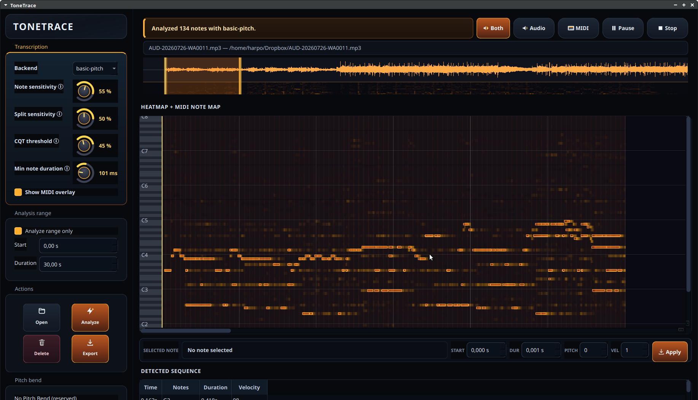

# ToneTrace

**Audio-to-MIDI transcription for Linux / free software.**

ToneTrace analyzes an audio sample, visualizes pitch salience as a piano-roll
heatmap, extracts candidate MIDI notes, and lets you compare the original audio
against the generated MIDI — then edit and export the result.

> ⚠️ **Work in progress.** This is an early Linux/free-software spike inspired by
> noteGRABBER-style workflows. It currently ships a CLI, a local browser viewer,
> a local upload server, and a native standalone GUI. There is **no VST / LV2 /
> CLAP plugin yet** — that is future work. Expect rough edges.
>
> The Python package and CLI are still named `notegrabber`; **ToneTrace** is the
> product name of the native GUI.



## Motivation

Transcribing a recorded phrase — a bass line, a vocal melody, a synth lead —
into editable MIDI usually means reaching for closed, Windows/macOS-first tools.
ToneTrace is an attempt to build that workflow on **Linux with free software and
open Python tooling**: load a sample, *see* the pitch content as a heatmap,
audition the original against the transcription, correct the notes by hand, and
export MIDI — all locally, no cloud, no proprietary plugin host required.

It is deliberately scoped as a spike: get the analyze → visualize → compare →
edit → export loop feeling good first, and move toward a real audio plugin later.

## Backends

Three transcription backends, selectable per run:

| Backend       | What it is | Best for |
|---------------|------------|----------|
| `basic-pitch` | [Spotify Basic Pitch](https://github.com/spotify/basic-pitch) / ONNX ML transcription | **Default and best for real audio.** Strong polyphonic note detection. |
| `cqt`         | [librosa](https://librosa.org/) Constant-Q Transform heatmap + heuristic extraction | Music-aligned heatmaps; supports instant in-GUI threshold retuning without rerunning a model. |
| `simple`      | Deterministic stdlib DSP baseline | Synthetic test fixtures; no ML/DSP dependencies. |

Tuning knobs (note sensitivity, split sensitivity, CQT threshold, minimum note
duration) are exposed on both the CLI and the GUI.

## Requirements

- **Linux** (developed and tested there; not tested on other platforms)
- **Python ≥ 3.10**
- Optional: **TiMidity++** on your `PATH` for rendering MIDI audio previews
  (`sudo apt install timidity` on Debian/Ubuntu)

## Installation

Clone the repo and install with the extras you need. Using a virtual environment
is recommended.

```bash
git clone https://github.com/harpomaxx/tonetrace.git
cd tonetrace
python3 -m venv .venv && source .venv/bin/activate

# Everything (ML backends + native GUI):
pip install -e '.[standalone]'
```

Or install a narrower set of extras:

```bash
pip install -e '.[gui]'          # native GUI only (PySide6 + pyqtgraph)
pip install -e '.[ml]'           # CQT + Basic Pitch backends, no GUI
pip install -e '.[basic-pitch]'  # Basic Pitch backend only
pip install -e '.[cqt]'          # CQT backend only
pip install -e .                 # base package (simple backend only)
```

## Usage

### Native GUI (ToneTrace)

```bash
notegrabber-gui                 # launch empty
notegrabber-gui input.mp3       # launch and open a file
notegrabber gui                 # equivalent via the CLI
```

Open an audio file, optionally drag a range on the waveform to analyze just a
section (handy for long files), pick a backend, and click **Analyze**. Then:

- Compare **Both** / **Audio** / **MIDI** playback with a synchronized playhead.
- Inspect the heatmap and MIDI note overlay; zoom (Ctrl+wheel time, Shift+wheel
  pitch) and scroll.
- Select, drag, resize, retune, and delete notes; edits re-render the MIDI
  preview.
- **Export** the edited notes as a Standard MIDI File.

### CLI

```bash
# Analyze to a MIDI file (+ optional heatmap JSON):
notegrabber analyze input.wav --out output.mid
notegrabber analyze input.wav --out output.mid --heatmap heatmap.json --backend basic-pitch

# Generate a self-contained browser viewer:
notegrabber visualize input.wav --out-dir viewer-dir

# Run a local upload/re-analysis web app:
notegrabber serve --out-dir out/server
```

Common tuning flags on `analyze` / `visualize`:

- `--threshold` — CQT heatmap-to-note activation threshold
- `--onset-threshold` / `--frame-threshold` — Basic Pitch thresholds
- `--min-duration` — minimum note length (seconds)

## Development

```bash
pip install -r requirements-dev.txt
pip install -e '.[standalone]'

# Run the test suite (GUI tests run offscreen when PySide6 is installed):
NOTEGRABBER_BIN=notegrabber python3 -m pytest -q
```

See [`AGENTS.md`](AGENTS.md) for the architecture and contribution notes,
[`FEATURES.md`](FEATURES.md) for the current feature list, and
[`issues/`](issues/) for the tracked performance backlog.

## Status & roadmap

Implemented: CLI transcription, browser viewer, local server, and a native
PySide6 GUI with background analysis, waveform/heatmap views, playback
comparison, note editing, and MIDI export.

Not yet: VST/LV2/CLAP plugin formats, project save/load, and undo/redo. The
near-term focus is UI polish, speed/responsiveness, and playback/zoom
refinement.

## License

Released under the [MIT License](LICENSE).
