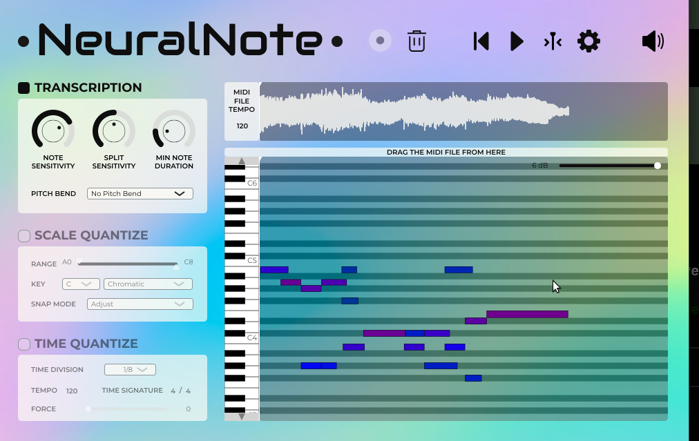

# Standalone Linux GUI plan

This folder collects the design notes for implementing **ToneTrace**, a native Linux standalone audio-to-MIDI application inspired by the NeuralNote layout while preserving the features already implemented in this repository.

Reference screenshot copied from the user prompt:



## Goal

Build a free-software Linux desktop app that feels like a standalone audio-to-MIDI workstation:

- load or drag an audio sample
- run Basic Pitch by default, with CQT as an alternate visual/fallback backend
- show waveform, heatmap, MIDI rectangles, piano keyboard, and sequence/minimap
- provide NeuralNote-like left controls for transcription sensitivity, minimum note duration, pitch bend, quantization, and timing
- play original audio and rendered MIDI for A/B comparison
- allow live retuning and export of the tuned MIDI

## Recommendation

Use **PySide6 + Qt Widgets + QGraphicsView/custom QWidget painting** for the first standalone Linux app.

Why:

- the codebase is already Python and can reuse `analyzer.py`, `midi.py`, and existing Basic Pitch/CQT dependencies directly
- Qt provides mature Linux file dialogs, menus, sliders, dials, splitters, scroll areas, audio playback, and packaging paths
- `QGraphicsView`/custom painting maps naturally to waveform, heatmap, piano roll rectangles, minimap, and selection overlays
- this avoids a rewrite into C++/JUCE before the UX is validated

Alternative if speed of implementation matters more than native widgets: wrap the current HTML viewer with `pywebview` or Tauri and call the existing local server. This reuses the most UI code, but makes deep MIDI editing/export less clean than a native model-view architecture.

## Files in this folder

- [`ui-spec.md`](./ui-spec.md) — NeuralNote-inspired layout and feature mapping.
- [`research-notes.md`](./research-notes.md) — toolkit/library examples and links found during web research.
- [`implementation-plan.md`](./implementation-plan.md) — phased implementation plan for the standalone app.
- [`neuralnote-reference.png`](./neuralnote-reference.png) — local copy of the screenshot supplied by the user.

## Current implementation status

The first native standalone implementation now lives under `src/notegrabber/gui/`. The visible GUI brand/window title is **ToneTrace**; the current development launch commands are still:

```bash
notegrabber-gui
notegrabber gui
```

Implemented in the GUI:

- Basic Pitch default backend with CQT/simple alternatives
- Qt file dialog/open-on-startup audio loading
- background waveform preview loading with click-to-seek playhead, drag-to-select analysis ranges, and draggable selection handles, including non-WAV fallback previews through standalone/librosa dependencies
- background low-resolution full-song pitch overview for finding sample/chop regions before detailed analysis
- background analysis worker using existing Python backends, with optional time-range extraction for long files that is offset back onto the full-song timeline
- heatmap/piano-roll widget with MIDI note overlay, keyboard axis, Ctrl+wheel horizontal time zoom, Shift+wheel vertical pitch zoom, scrolling, and pixel-aggregated drawing for large/long analyses
- NeuralNote-inspired left controls for backend, note sensitivity, split sensitivity, CQT threshold, minimum duration, and analysis range
- original audio and rendered MIDI WAV playback through Qt Multimedia
- Play both / Original / MIDI / Pause / Stop transport controls
- seeking both players from waveform, piano roll, or sequence table
- detected sequence table grouped by onset/chords
- MIDI rectangle selection/highlighting with selected-note details
- Delete/Backspace/delete button removes selected notes from the tuned list
- selected-note inspector editing for start, duration, pitch, and velocity
- piano-roll hover handles/cursor feedback plus drag editing for moving notes and resizing note boundaries
- MIDI WAV preview re-rendering after inspector edits, deletes, CQT retunes, and committed piano-roll drags when rendering is enabled
- polished first-pass dark pro-DAW Qt theme with warm red/orange/yellow accents, rounded cards, styled controls, compact action pad, SVG button icons, and explanatory slider tooltips
- export current analyzed/tuned/edited/deleted note list to MIDI

Still pending / next priorities:

- continued playback/playhead synchronization polish between waveform, heatmap, original audio, and rendered MIDI preview; smooth interpolated shared playhead sync plus range-aware MIDI preview timeline mapping are implemented
- zoom/navigation polish: note edits/clicks no longer compound zoom; mouse-wheel time/pitch zoom is implemented without left-panel zoom sliders; still pending cursor-centered Ctrl+wheel zoom, fit-to-selection/full-song actions, and stable scroll position when zooming out
- speed/responsiveness polish: cancel long jobs, better progress detail, optional overview/heatmap level-of-detail caching, and background/debounced MIDI preview rendering if TiMidity++ blocks
- UI polish for the sampler workflow: clearer selected-region affordances, denser but readable controls, stronger hierarchy between overview waveform and detail piano roll
- optional ghost-preview polish during note drag
- undo/redo and keyboard nudging for edits
- custom knob/dial styling for the transcription controls
- native minimap/CSV copy parity with the browser viewer
- richer Qt audio error/volume UI

## Current project features to carry over/keep aligned

- `basic-pitch` backend as default for real samples
- `cqt` backend for music-aligned heatmap/fallback
- heatmap JSON model and GUI model conversion in `gui/state.py`
- MIDI note extraction and writer
- static/local-server viewer feature set
- waveform preview
- live threshold/min-duration retuning
- sequence/minimap/table concepts
- CSV copy in browser viewer; native GUI parity later
- original vs rendered MIDI playback

## Non-goals for first standalone milestone

- VST/LV2/CLAP plugin
- full DAW piano-roll editing parity
- realtime audio capture from DAW
- cloud upload or online services
- exact NeuralNote visual clone/branding
